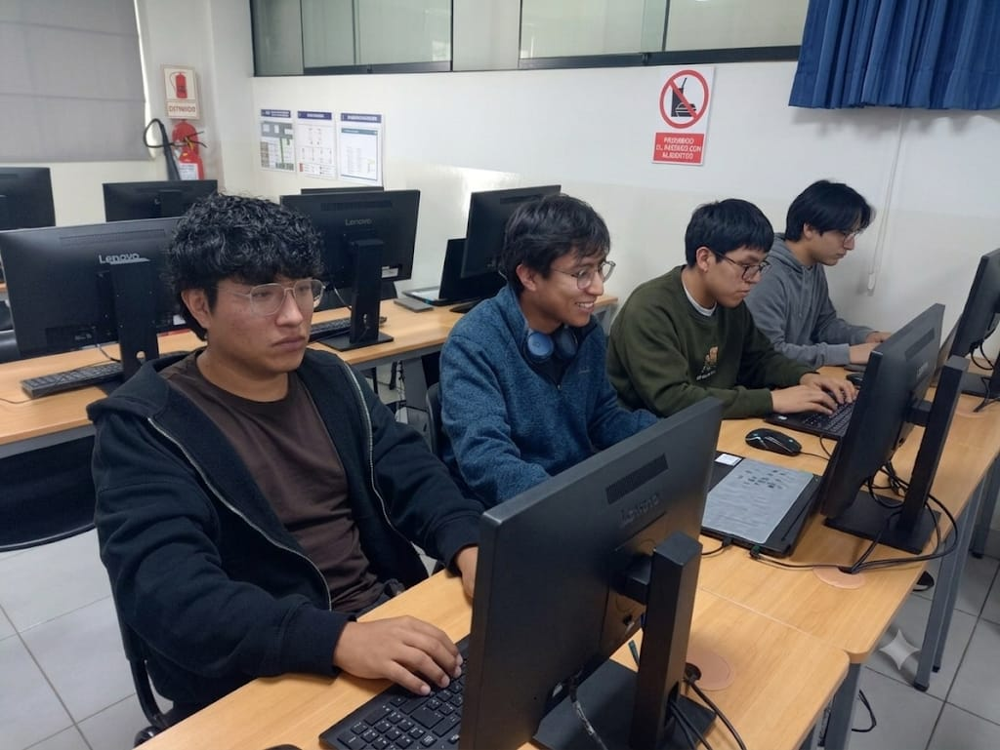

# Planner-UC (Generador Óptimo de Horarios Académicos)

<div align="center">


*Producto Mínimo Viable (PMV) para la generación automática de horarios universitarios.*

---

</div>

## Tabla de Contenido
1. [Nombre del proyecto](#nombre-del-proyecto)
2. [Integrantes del equipo](#integrantes-del-equipo)
3. [Problemática abordada](#problemática-abordada)
4. [Justificación del PMV](#justificación-del-pmv)
5. [Tecnologías utilizadas](#tecnologías-utilizadas)
6. [Arquitectura del sistema](#arquitectura-del-sistema)
7. [Instrucciones de instalación](#instrucciones-de-instalación)
8. [Instrucciones de build](#instrucciones-de-build)
9. [Instrucciones de despliegue](#instrucciones-de-despliegue)
10. [Enlace a video explicativo](#enlace-a-video-explicativo)
11. [Enlaces a la documentación (docs/)](#enlaces-a-la-documentación-ubicada-en-la-carpeta-docs)

---

## 1. Nombre del proyecto
**Planner-UC** (Equipo: *OptiHorario*)

## 2. Integrantes del equipo
| Nombre | Rol principal |
| :--- | :--- |
| **Araujo Huamani, Leonardo Daniel** | Analista de Sistemas |
| **Curi Untiveros, Jefferson Diego** | Diseñador de Software |
| **Vasquez Miranda, Luis Alexis** | Líder / Desarrollador Backend |
| **Vilcarano De La Cruz, Frank** | Desarrollador Frontend y QA |

<div align="center">
  
</div>

## 3. Problemática abordada
La planificación académica universitaria tradicional requiere un esfuerzo humano intensivo y es propensa a errores combinatorios. Cuadrar la disponibilidad de aulas, aforos, cruces de cursos y secciones demanda semanas de trabajo administrativo, generando fricciones en entornos de currículo flexible y provocando problemas en la experiencia del estudiante.

## 4. Justificación del PMV
Planner-UC aborda este **Problema Complejo de Ingeniería** automatizando la generación de horarios mediante algoritmos matemáticos de optimización. El Producto Mínimo Viable (PMV v1.0.0) justifica su existencia al reducir el tiempo de creación de horarios de días a **menos de 60 segundos**, validando matemáticamente restricciones duras (choques de aula, excesos de aforo) y proporcionando una interfaz web intuitiva para la gestión académica.

## 5. Tecnologías utilizadas
* **Frontend (Cliente):** Next.js, React, TypeScript, Tailwind CSS
* **Backend (Servidor):** Python, FastAPI
* **Motor de Optimización:** Google OR-Tools (CP-SAT Solver)
* **Base de Datos y Autenticación:** Supabase (PostgreSQL)
* **Calidad y Pruebas:** Jest, Cypress, SonarQube, pytest

## 6. Arquitectura del sistema
El software está diseñado bajo el patrón de **Arquitectura por capas separadas** (Client-Server), garantizando la separación de responsabilidades, mantenibilidad y escalabilidad:
* **Frontend (Capa de Presentación):** Consume la API, maneja la interfaz administrativa (UI/UX) y persiste los datos en Supabase.
* **Backend (Capa de Lógica/Negocio):** Recibe cargas útiles (payloads), ejecuta el modelo matemático de programación de restricciones (Constraint Programming) y devuelve los horarios viables generados.

## 7. Instrucciones de instalación
Para configurar el entorno de desarrollo en una máquina local:

**Requisitos previos:** Node.js (v20+), Python (v3.10+), y `uv` instalado.

1. **Clonar el repositorio:**
   ```bash
   git clone https://github.com/Diegodxd-1/planner-UC.git
   cd planner-UC
   ```

2. **Instalar Backend:**
   ```bash
   cd Backend
   uv sync
   ```

3. **Instalar Frontend:**
   ```bash
   cd ../frontend
   npm install
   ```

## 8. Instrucciones de build
Para generar los empaquetados optimizados para producción:

**Frontend:**
```bash
cd frontend
npm run build
```

**Backend:**
Al ser una aplicación basada en FastAPI/Python, el build se gestiona mediante la sincronización del entorno y la ejecución directa del servidor ASGI, no requiere transpilación.

## 9. Instrucciones de despliegue
Para levantar el sistema de manera local (Entorno de desarrollo / demostración):

**1. Desplegar el Backend:**
Abre una terminal y ejecuta:
```bash
cd Backend
uv run uvicorn app.main:app --reload
```
*(El servidor estará escuchando en http://localhost:8000)*

**2. Desplegar el Frontend:**
Abre una segunda terminal y ejecuta:
```bash
cd frontend
npm run dev
```
*(La aplicación web estará disponible en http://localhost:3000)*

## 10. Enlace a video explicativo
[👉 Ver Video de Demostración del PMV](docs/otros/Video%20demostrativo%20PMV.mp4)

## 11. Enlaces a la documentación ubicada en la carpeta `docs/`
La documentación del proyecto sigue la estructura basada en las áreas de conocimiento del estándar **PMBOK**:

### a. Inicio
* [Documento Inicial del Problema](docs/inicio/Documento%20inicial%20del%20problema%20(primer%20borrador).md)
* [Declaración de la Visión y del Equipo](docs/inicio/Declaración%20de%20la%20visión%20del%20proyecto.md)
* [Project Charter (Acta de Constitución Inicial)](docs/inicio/Project%20Charter.md)
* [Registro de Supuestos y Restricciones](docs/inicio/Registro%20de%20supuestos%20y%20restricciones.md)

### b. Planificación
* [Backlog Detallado](docs/planificacion/Backlog%20Detallado%20del%20Proyecto%20(Hoja%201).md)
* [Costos del proyecto](docs/planificacion/Costo%20acumulado%20del%20proyecto.md)

### c. Ejecución
* [Documentación Técnica (Backend / Solver)](docs/backend/README.md)
* [Especificación Formal de Reglas (Spec)](Spec.md)

### d. Seguimiento y Control
* [Evidencias de SonarQube, Accesibilidad (WCAG) y Seguridad (OWASP)](docs/evidencias/README.md)

### e. Cierre
* [Informe Final del Proyecto](docs/cierre/informe-final-del-proyecto.md)
* [Informe Final de Lecciones Aprendidas](docs/cierre/informe-final-de-lecciones-aprendidas.md)
* [Registro de Riesgos](docs/cierre/registro-de-riesgos.md)
* [Registro de Incidentes y Problemas](docs/cierre/registro-de-incidentes-o-problemas.md)
* [Acta de Constitución Revisada](docs/cierre/acta-de-constitucion-del-proyecto.md)

---
*Desarrollado para el curso Taller de Proyectos 2 – Ingeniería de Sistemas e Informática.*
