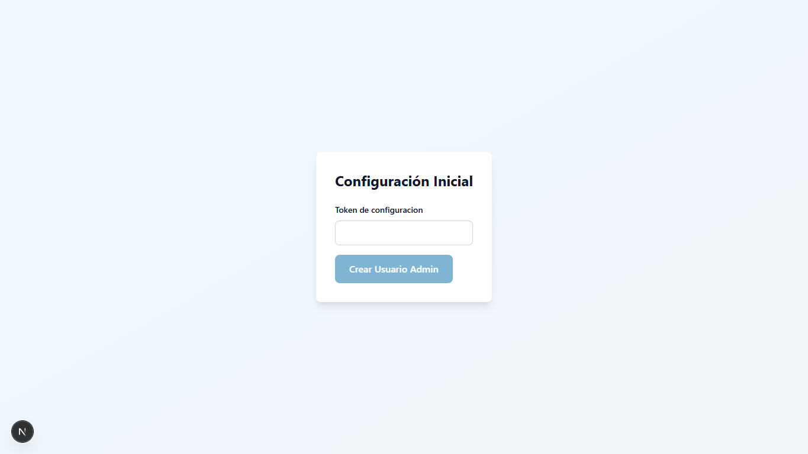

# 6.2. Auditoria tecnica de seguridad OWASP Top 10 2025

## 1. Alcance y referencia

La auditoria se realizo sobre Planner-UC con foco en:

- Frontend Next.js + Supabase: autenticacion, gestion administrativa y rutas API internas.
- Backend FastAPI: endpoint publico de generacion demo de horarios.
- Dependencias npm productivas y de desarrollo.
- Configuracion HTTP expuesta por la aplicacion web.

Referencia tecnica: OWASP Top 10:2025, lista oficial publicada por OWASP:

1. A01 Broken Access Control
2. A02 Security Misconfiguration
3. A03 Software Supply Chain Failures
4. A04 Cryptographic Failures
5. A05 Injection
6. A06 Insecure Design
7. A07 Authentication Failures
8. A08 Software or Data Integrity Failures
9. A09 Security Logging and Alerting Failures
10. A10 Mishandling of Exceptional Conditions

Fuente: https://owasp.org/Top10/2025/

## 2. Actividades obligatorias realizadas

| Actividad | Resultado tecnico |
| --- | --- |
| Identificacion de vulnerabilidades | Se revisaron rutas API administrativas, setup inicial, sesiones Supabase, CORS backend, errores 500, dependencias npm y cabeceras HTTP. |
| Clasificacion de riesgos | Cada hallazgo se clasifico por categoria OWASP 2025, severidad, impacto y exposicion. |
| Analisis de impacto | Se documento el posible impacto en confidencialidad, integridad, disponibilidad y control administrativo. |
| Evaluacion de exposicion | Se diferencio exposicion publica (`/api/setup`, backend demo, dependencias productivas) de exposicion autenticada (`/api/users`, `/api/courses`, `/api/rooms`). |
| Validacion de autenticacion | Se verifico Supabase `auth.getUser()` en servidor para operaciones administrativas. |
| Validacion de autorizacion | Se reforzo `requireAdminAccess()` para exigir rol `administrador` y perfil activo. |
| Manejo de sesiones | Se preservo middleware Supabase para refresco seguro de sesiones y se evitaron clientes admin en cliente. |
| Sanitizacion de entradas | Se agrego parseo JSON controlado y validaciones de email, contrasena, roles, IDs y aforos. |
| Proteccion contra ataques comunes | Se mitigaron CORS amplio, filtrado de errores internos, clickjacking, MIME sniffing, framing, setup publico y dependencias vulnerables productivas. |

## 3. Matriz de vulnerabilidades

| ID | OWASP 2025 | Hallazgo | Riesgo inicial | Impacto | Exposicion | Mitigacion implementada | Riesgo residual |
| --- | --- | --- | --- | --- | --- | --- | --- |
| V-01 | A01 Broken Access Control / A07 Authentication Failures | `/api/setup` permitia intentar crear el admin inicial mediante POST publico si no existia usuario admin. | Alto | Creacion no autorizada del administrador inicial en entornos mal configurados. | Publica | `POST /api/setup` ahora exige `INITIAL_ADMIN_SETUP_TOKEN` enviado por header `x-setup-token`; si el token no existe falla cerrado con 503. La UI `/setup` solicita token. | Bajo. Depende de custodiar el token fuera del cliente. |
| V-02 | A01 Broken Access Control | `requireAdminAccess()` validaba rol, pero no bloqueaba perfiles inactivos. | Medio | Un perfil admin desactivado podria conservar acceso si la sesion seguia vigente. | Autenticada | Se exige `is_active = true` ademas de rol `administrador`. | Bajo. Supabase sigue siendo fuente de verdad del estado. |
| V-03 | A02 Security Misconfiguration | Backend FastAPI aceptaba `allow_methods=["*"]` y `allow_headers=["*"]`. | Medio | Superficie CORS innecesaria para un endpoint solo lectura. | Publica | CORS restringido a origenes configurados, metodos `GET/OPTIONS` y headers `Accept/Content-Type`. | Bajo. En produccion debe definirse `BACKEND_CORS_ORIGINS`. |
| V-04 | A10 Mishandling of Exceptional Conditions | El backend devolvia detalles internos de excepciones del solver en la respuesta 500. | Medio | Filtracion de informacion tecnica util para reconocimiento. | Publica | Se registra la excepcion en servidor y se devuelve mensaje generico al cliente. | Bajo. Logs deben resguardarse en produccion. |
| V-05 | A03 Software Supply Chain Failures | `npm audit --omit=dev` detecto 3 vulnerabilidades productivas: 1 alta y 2 moderadas. | Alto | Riesgo de DoS, bypass/poisoning o vulnerabilidades transitivas en runtime frontend. | Productiva | Next.js actualizado a `^16.2.9` y `overrides` para `postcss@8.5.10` y `ws@8.20.1`. Auditoria productiva final: 0 vulnerabilidades. | Bajo. Mantener auditoria en CI. |
| V-06 | A05 Injection / A10 Mishandling of Exceptional Conditions | Rutas administrativas parseaban `request.json()` directamente; JSON invalido podia producir excepcion no controlada. | Medio | Errores 500 evitables y menor robustez ante entradas maliciosas. | Autenticada | Nuevo helper `parseJsonObject()` retorna 400 para JSON invalido o payload no objeto. Aplicado a usuarios, cursos y aulas. | Bajo. Validaciones de negocio siguen por modulo. |
| V-07 | A05 Injection / A07 Authentication Failures | Creacion/actualizacion de usuarios aceptaba correo con validacion debil y contrasenas desde 8 caracteres sin complejidad. | Medio | Cuentas mas faciles de atacar por credenciales debiles o datos mal formados. | Autenticada admin | Email con patron formal y contrasena minima de 10 caracteres con mayuscula, minuscula y numero. | Medio-bajo. Falta MFA/politica avanzada de Supabase. |
| V-08 | A05 Injection / A06 Insecure Design | `authorized_capacity` de aulas no validaba rango contra `capacity`. | Bajo | Inconsistencia de datos y posibles reportes administrativos incorrectos. | Autenticada admin | `authorized_capacity` debe ser entero positivo y menor o igual al aforo total. | Bajo. |
| V-09 | A02 Security Misconfiguration | No habia cabeceras defensivas globales para clickjacking, MIME sniffing, referrer, permisos o CSP minima. | Medio | Mayor exposicion ante clickjacking, sniffing y embedding no autorizado. | Publica | Cabeceras globales: `X-Content-Type-Options`, `X-Frame-Options`, `Referrer-Policy`, `Permissions-Policy`, CSP parcial. | Bajo. CSP puede endurecerse mas cuando se auditen scripts externos. |
| V-10 | A09 Security Logging and Alerting Failures | El proyecto registra errores criticos con `console.error`/logging basico, sin alerta centralizada. | Bajo | Menor capacidad de deteccion temprana en produccion. | Operativa | Se preserva logging de errores en servidor; se documenta como riesgo residual por falta de SIEM/alertas. | Medio. Requiere infraestructura de monitoreo. |

## 4. Evidencia tecnica de mitigacion

| Mitigacion | Archivos modificados | Evidencia |
| --- | --- | --- |
| Setup inicial protegido por token | `frontend/app/api/setup/route.ts`, `frontend/app/setup/page.tsx` | `docs/evidencias/owasp/setup-token-required.png`, `docs/evidencias/owasp/setup-post-without-token.json` |
| Admin activo obligatorio | `frontend/lib/auth/server-auth.ts` | Revisado por pruebas de build y flujo de API administrativo. |
| JSON administrativo controlado | `frontend/app/api/_shared/admin-mutations.ts`, rutas `courses`, `rooms`, `users` | `frontend/app/api/_shared/__tests__/admin-mutations.test.ts` |
| Validacion de contrasenas/email | `frontend/app/api/users/route.ts`, `frontend/app/api/users/[id]/route.ts` | Pruebas frontend completas: 51 passed. |
| Validacion de aforo autorizado | `frontend/app/api/rooms/room-payload.ts` | `frontend/app/api/rooms/__tests__/room-payload.test.ts` |
| Headers defensivos | `frontend/next.config.ts` | `docs/evidencias/owasp/security-headers.json`, `frontend/__tests__/next-config.test.ts` |
| CORS y errores backend | `backend/app/main.py` | `backend/tests/test_api.py` |
| Dependencias productivas | `frontend/package.json`, `frontend/package-lock.json` | `docs/evidencias/owasp/npm-audit-production.json`, `docs/evidencias/owasp/npm-audit-production-after.json` |

## 5. Pruebas de validacion

| Prueba | Resultado |
| --- | --- |
| `npm run lint` en frontend | Correcto |
| `npm test -- --runInBand` en frontend | 19 suites, 51 tests passed |
| `npm run build` en frontend | Correcto con Next.js 16.2.9 |
| `uv run pytest` en backend | 39 tests passed |
| `uv run pytest --cov=app --cov-report=xml:coverage.xml` en backend | 39 tests passed y coverage XML generado |
| `npm audit --omit=dev` antes | 3 vulnerabilidades productivas: 1 alta, 2 moderadas |
| `npm audit --omit=dev` despues | 0 vulnerabilidades productivas |
| CORS backend desde origen no autorizado | Sin `access-control-allow-origin` |
| CORS backend desde `http://localhost:3000` | Permitido |
| POST `/api/setup` sin token/configuracion | Falla cerrado con 503 y `created:false` |

Resumen verificable: `docs/evidencias/owasp/validation-summary.json`.

## 6. Capturas y evidencias obligatorias

| Evidencia | Archivo |
| --- | --- |
| Captura de setup con token requerido | `docs/evidencias/owasp/setup-token-required.png` |
| Respuesta API setup sin token | `docs/evidencias/owasp/setup-post-without-token.json` |
| Cabeceras HTTP reales | `docs/evidencias/owasp/security-headers.json` |
| Auditoria npm completa antes | `docs/evidencias/owasp/npm-audit.json` |
| Auditoria npm completa despues | `docs/evidencias/owasp/npm-audit-after.json` |
| Auditoria npm productiva antes | `docs/evidencias/owasp/npm-audit-production.json` |
| Auditoria npm productiva despues | `docs/evidencias/owasp/npm-audit-production-after.json` |
| Log frontend dev para captura | `docs/evidencias/owasp/frontend-dev.log` |

## 7. Analisis de riesgo residual

| Riesgo residual | Nivel | Justificacion | Recomendacion |
| --- | --- | --- | --- |
| Vulnerabilidades en dependencias de desarrollo | Medio-bajo | Auditoria completa final conserva 7 vulnerabilidades en herramientas de desarrollo (`cypress`, `msw`, `eslint` transitorios). No afectan el paquete productivo auditado con `--omit=dev`. | Planificar upgrade de Cypress mayor y MSW cuando se pueda validar E2E. |
| Falta MFA para administradores | Medio | Supabase autentica por email/contrasena; no se evidencio MFA en el alcance actual. | Activar MFA o politicas de autenticacion reforzada en Supabase para cuentas admin. |
| Logging sin alertas centralizadas | Medio | Hay logging basico, pero no SIEM, alertas ni trazabilidad centralizada. | Integrar logs de backend/frontend con alertas de errores 4xx/5xx y eventos admin. |
| Token de setup depende de custodia operativa | Bajo | El endpoint falla cerrado si no existe token, pero el secreto debe gestionarse fuera del cliente. | Guardar `INITIAL_ADMIN_SETUP_TOKEN` solo en entorno servidor y rotarlo tras bootstrap. |
| CSP parcial | Bajo | Se bloquea framing/object/base-uri, pero no se definio CSP completa para scripts/estilos por compatibilidad con Next. | Endurecer CSP con nonces en una iteracion especifica. |

## 8. Conclusion tecnica

La auditoria OWASP Top 10:2025 identifico riesgos reales en control de acceso inicial, configuracion, manejo de errores, validacion de entradas y cadena de suministro. Se implementaron mitigaciones verificables sin cambiar la arquitectura del proyecto: Supabase sigue gestionando autenticacion/roles en frontend y FastAPI conserva la responsabilidad del solver.

El estado final reduce la exposicion principal:

- Setup inicial protegido por token y falla cerrado.
- API administrativa exige usuario autenticado, rol administrador y perfil activo.
- Entradas administrativas usan parseo JSON controlado y validaciones de negocio.
- Backend restringe CORS y no filtra excepciones internas.
- Frontend emite cabeceras defensivas globales.
- Dependencias productivas quedan con 0 vulnerabilidades en `npm audit --omit=dev`.

El riesgo residual se concentra en herramientas de desarrollo, MFA, monitoreo y CSP avanzada.
