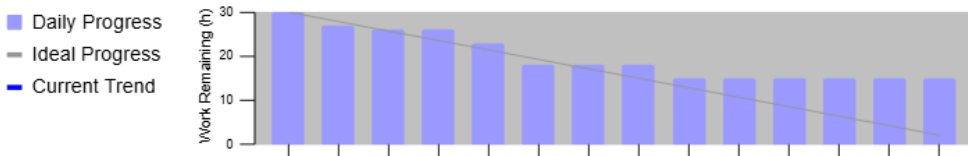

## Sprint 1 Backlog

**Nombre del Proyecto:** Panner - UC  
**Dueño del Proyecto:** OptiHorario  
**Gerente del Proyecto:** Grupo 05  

---

### Información General

- **Duración del Sprint:** 14 días  
- **Task rows:** 10  
- **Done days:** 14  

---

### Tendencia del Sprint

| Día | Totales | Ideal | Tendencia |
|-----|--------|-------|-----------|
| 1   | 30     | 30    | 27.60     |
| 2   | 30     | 27.86 | 26.39     |
| 3   | 27     | 25.71 | 25.17     |
| 4   | 26     | 23.57 | 23.96     |
| 5   | 26     | 21.43 | 22.75     |
| 6   | 23     | 19.29 | 21.53     |
| 7   | 18     | 17.14 | 20.32     |
| 8   | 18     | 15.00 | 19.11     |
| 9   | 18     | 12.86 | 17.89     |
| 10  | 15     | 10.71 | 16.68     |
| 11  | 15     | 8.57  | 15.47     |
| 12  | 15     | 6.43  | 14.25     |
| 13  | 15     | 4.29  | 13.04     |
| 14  | 15     | 2.14  | 11.83     |

---

### Tareas del Sprint

| ID   | Tarea                  | Historia | Responsable | Estado        | Est | D1 | D2 | D3 | D4 | D5 | D6 | D7 | D8 | D9 | D10 | D11 | D12 | D13 | D14 |
|------|------------------------|----------|-------------|--------------|-----|----|----|----|----|----|----|----|----|----|-----|-----|-----|-----|-----|
| 1.1  | Registro usuarios      | HU01     | LUIS        | Terminado    | 3   | 3  | 0  | 0  | 0  | 0  | 0  | 0  | 0  | 0  | 0   | 0   | 0   | 0   | 0   |
| 1.2  | Login sistema          | HU02     | FRANK       | Terminado    | 1   | 1  | 1  | 0  | 0  | 0  | 0  | 0  | 0  | 0  | 0   | 0   | 0   | 0   | 0   |
| 1.3  | Registrar cursos       | HU03     | DANIEL      | Terminado    | 3   | 3  | 3  | 3  | 3  | 0  | 0  | 0  | 0  | 0  | 0   | 0   | 0   | 0   | 0   |
| 1.4  | Registrar docentes     | HU04     | DIEGO       | Terminado    | 3   | 3  | 3  | 3  | 3  | 3  | 0  | 0  | 0  | 0  | 0   | 0   | 0   | 0   | 0   |
| 1.5  | Registrar aulas        | HU05     | LUIS        | Terminado    | 2   | 2  | 2  | 2  | 2  | 2  | 0  | 0  | 0  | 0  | 0   | 0   | 0   | 0   | 0   |
| 1.6  | Definir bloques        | HU06     | DANIEL      | En Progreso  | 3   | 3  | 3  | 3  | 3  | 3  | 3  | 3  | 3  | 0  | 0   | 0   | 0   | 0   | 0   |
| 1.7  | Detectar conflictos    | HU08     | FRANK       | En Progreso  | 4   | 4  | 4  | 4  | 4  | 4  | 4  | 4  | 4  | 4  | 4   | 4   | 4   | 4   | 4   |
| 1.8  | Generar horarios       | HU07     | DIEGO       | En Progreso  | 5   | 5  | 5  | 5  | 5  | 5  | 5  | 5  | 5  | 5  | 5   | 5   | 5   | 5   | 5   |
| 1.9  | Editar horarios        | HU10     | LUIS        | Por Hacer    | 3   | 3  | 3  | 3  | 3  | 3  | 3  | 3  | 3  | 3  | 3   | 3   | 3   | 3   | 3   |
| 1.10 | Ver horarios           | HU09     | LUIS        | Por Hacer    | 3   | 3  | 3  | 3  | 3  | 3  | 3  | 3  | 3  | 3  | 3   | 3   | 3   | 3   | 3   |

---

### Burndown Chart

