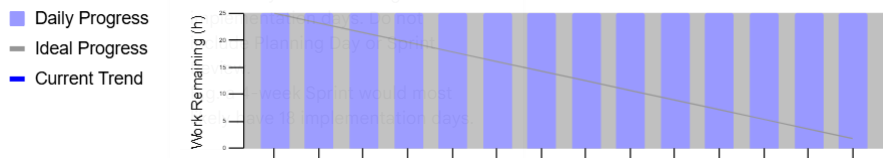

## Sprint 2 Backlog

**Nombre del Proyecto:** Panner - UC  
**Dueño del Proyecto:** OptiHorario  
**Gerente del Proyecto:** Grupo 05  

---

### Información General

- **Duración del Sprint:** 14 días  
- **Task rows:** 7  
- **Done days:** 14  

---

### Tendencia del Sprint

| Día | Totales | Ideal | Tendencia |
|-----|--------|-------|-----------|
| 1   | 25     | 25.00 | 25.00     |
| 2   | 25     | 23.21 | 25.00     |
| 3   | 25     | 21.43 | 25.00     |
| 4   | 25     | 19.64 | 25.00     |
| 5   | 25     | 17.86 | 25.00     |
| 6   | 25     | 16.07 | 25.00     |
| 7   | 25     | 14.29 | 25.00     |
| 8   | 25     | 12.50 | 25.00     |
| 9   | 25     | 10.71 | 25.00     |
| 10  | 25     | 8.93  | 25.00     |
| 11  | 25     | 7.14  | 25.00     |
| 12  | 25     | 5.36  | 25.00     |
| 13  | 25     | 3.57  | 25.00     |
| 14  | 25     | 1.79  | 25.00     |

---

### Tareas del Sprint

| ID  | Tarea                    | Historia | Responsable | Estado       | Est | D1 | D2 | D3 | D4 | D5 | D6 | D7 | D8 | D9 | D10 | D11 | D12 | D13 | D14 |
|-----|--------------------------|----------|-------------|--------------|-----|----|----|----|----|----|----|----|----|----|-----|-----|-----|-----|-----|
| 2.1 | Registrar estudiantes    | HU26     | LUIS        | En Progreso  | 3   | 3  | 3  | 3  | 3  | 3  | 3  | 3  | 3  | 3  | 3   | 3   | 3   | 3   | 3   |
| 2.2 | Matricular cursos        | HU27     | DANIEL      | En Progreso  | 5   | 5  | 5  | 5  | 5  | 5  | 5  | 5  | 5  | 5  | 5   | 5   | 5   | 5   | 5   |
| 2.3 | Consultar horarios       | HU11     | FRANK       | En Progreso  | 3   | 3  | 3  | 3  | 3  | 3  | 3  | 3  | 3  | 3  | 3   | 3   | 3   | 3   | 3   |
| 2.4 | Validar prerrequisitos   | HU28     | DIEGO       | En Progreso  | 5   | 5  | 5  | 5  | 5  | 5  | 5  | 5  | 5  | 5  | 5   | 5   | 5   | 5   | 5   |
| 2.5 | Validar créditos         | HU29     | LUIS        | En Progreso  | 3   | 3  | 3  | 3  | 3  | 3  | 3  | 3  | 3  | 3  | 3   | 3   | 3   | 3   | 3   |
| 2.6 | Guardar ejecuciones      | HU12     | DANIEL      | En Progreso  | 3   | 3  | 3  | 3  | 3  | 3  | 3  | 3  | 3  | 3  | 3   | 3   | 3   | 3   | 3   |
| 2.7 | Reporte conflictos       | HU30     | DANIEL      | Por Hacer    | 3   | 3  | 3  | 3  | 3  | 3  | 3  | 3  | 3  | 3  | 3   | 3   | 3   | 3   | 3   |

---

### Burndown Chart

